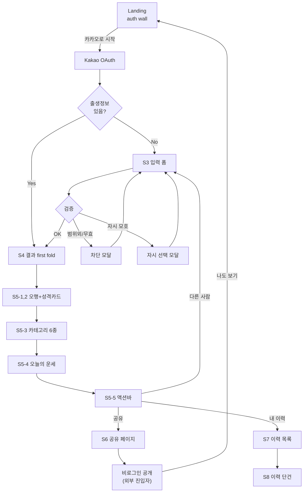
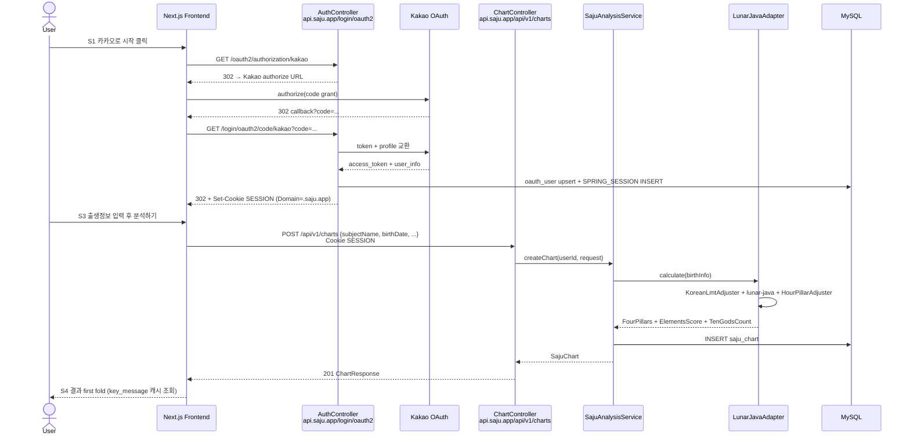
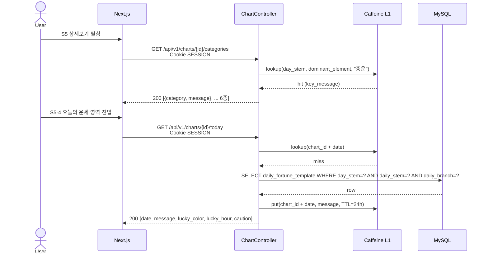
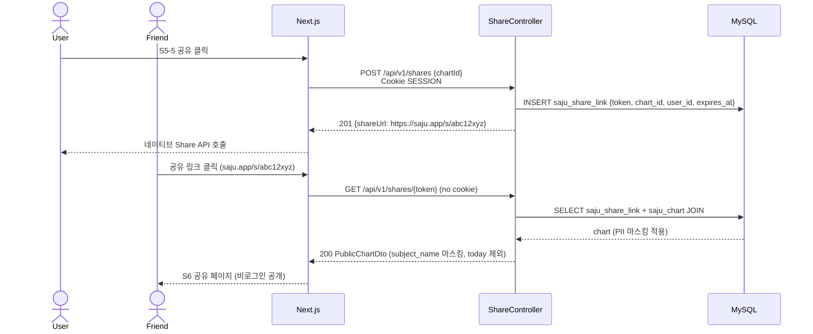
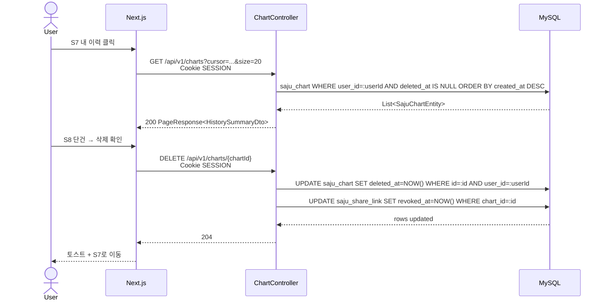

# Step 3: 사용 흐름 (User Flow) — MVP UX Wireframes (2026-04-29 갱신)

> 본 문서는 **화면 단위 와이어 + 인터랙션 매트릭스**를 정의합니다. 디자이너·프론트가 그대로 옮길 수 있는 수준의 명세를 목표로 합니다. 백엔드 시퀀스는 부록(5장)으로 분리.

---

## 1. 페르소나·핵심 가치 (UX Lock)

### 1.1 1차 페르소나 (P1)
- **이름**: 사주 처음 보는 20\~30대 MZ
- **맥락**: SNS·카카오톡으로 친구가 공유한 링크를 누르거나, 검색을 통해 진입
- **욕구**: "재미있게 내 성격·운세를 들여다보고, 친구에게 공유하고 싶다"
- **불호**: 명리학 용어 폭격, 가입 폼이 길거나, 결과가 무미건조한 8글자
- **디바이스**: 모바일 우선(70%), PC(30%) — PWA 단일 코드

### 1.2 핵심 가치 명제 (P2)
- **명리 요소 데이터화 + 구어 카피**
- 5가지 에너지(오행) 도넛, 성격 카드 6장(십신), 카테고리 6종 운세, 오늘의 운세 한 줄
- **명리 용어는 회피하지 않고, "상세보기" 토글 안으로 격리** — 호기심 사용자만 자발적으로 진입
- **공유는 일급 시민** — 결과 화면 자체가 "SNS 명함"이 되도록 first fold 디자인

### 1.3 변환 규칙 (디자인·카피 일관성)
| 명리 용어 | 사용자 노출 표현 | 보조 라벨 |
|---|---|---|
| 사주팔자 (年月日時) | 사주 4기둥 | 천간·지지 한자(작은 글자) |
| 오행 (목화토금수) | "당신의 5가지 에너지" | 木火土金水 (작은 한자) |
| 십신 (비겁·식상·재성·관성·인성·일주) | "성격 카드 6장" | 십신명 (펼쳤을 때만) |
| 일간 | "당신의 핵심 글자" | 갑(甲) 등 한자 |
| 일진 | "오늘의 기운" | 노출 없음 |

---

## 2. 사용자 여정 맵



---

## 3. 화면별 와이어 정의

각 화면은 **목적 / 구성요소 / 인터랙션 / 엣지케이스 / 마이크로카피**의 다섯 축으로 명세합니다.

### S1. Landing — 인증 게이트

- **목적**: 직접 방문 사용자를 카카오 로그인으로 즉시 유도. 마케팅 페이지 없음(이탈률 vs 단순함의 트레이드오프 — 단순함 채택, ADR-25)
- **URL**: `/`
- **상태별**:
  - 비로그인: 본 화면 표시
  - 로그인 + 출생정보 있음: `/chart/{lastChartId}`로 즉시 redirect
  - 로그인 + 출생정보 없음: `/onboarding`으로 즉시 redirect
- **구성요소**:
  - 상단: 앱 로고 (텍스트 마크 "사주" + 한자 보조)
  - 중앙: 1줄 hero 카피 + 1초 깊이의 키워드 3개
  - 메인 CTA: "카카오로 시작하기" (노란색 카카오 표준 버튼)
  - 하단: 미니 푸터 (이용약관, 개인정보처리방침)
- **인터랙션**:
  - "카카오로 시작" → `GET /oauth2/authorization/kakao` (백엔드 OAuth 플로우 시작)
  - 약관 링크 → 모달 표시
- **엣지케이스**:
  - 카카오 OAuth 실패 → 에러 토스트 + 재시도 버튼
  - 외부 공유 링크에서 진입한 사용자: `/share/{token}` 페이지가 별도 처리(S6), Landing 안 거침
- **마이크로카피**:
  - hero: "당신의 사주, 한눈에"
  - 키워드 3개: "5가지 에너지" · "성격 카드" · "오늘의 기운"
  - 약관: "카카오로 시작 = 이용약관·개인정보처리방침에 동의"

### S2. 카카오 OAuth Redirect (백엔드 헨들)

- **목적**: 카카오 인증 코드 교환 + 세션 발급. 사용자가 보는 화면 없음(자동 리다이렉트)
- **URL**: `https://api.saju.app/login/oauth2/code/kakao?code=...&state=...`
- **상태**:
  - 신규 사용자: 세션 발급 후 프론트 `/onboarding`으로 redirect
  - 기존 사용자(차트 있음): 세션 발급 후 `/chart/{lastChartId}`로 redirect
  - 기존 사용자(차트 없음): 세션 발급 후 `/onboarding`으로 redirect
- **인터랙션**: 사용자 액션 없음, 자동
- **엣지케이스**:
  - 인증 거부 / 쿠키 차단 / 사파리 ITP → 프론트가 401 받으면 Landing으로 fallback
  - 동일 IP 30 RPM 초과 → 429 Too Many Requests + Landing으로 redirect
- **로딩 표시**: 프론트는 redirect 도중 1초 이내 로딩 스피너 + "잠시만요…"

### S3. 출생정보 입력 폼 (Hybrid)

- **목적**: 사주 계산에 필요한 최소 정보 수집. 인라인 도움말로 "잘 모르겠다" 케이스 흡수
- **URL**: `/onboarding` (본인 차트 미존재 시) / `/chart/new` (다른 사람 분석 모드)
- **구성요소** (단일 화면 + 인라인 도움말):
  ```
  ┌─────────────────────────────────┐
  │ [본인 모드 ▼ / 다른 사람]         │  ← 토글
  │                                 │
  │ 이름        [_____________]      │  본인은 카카오 닉네임 자동 채움
  │ 생년월일    [YYYY-MM-DD]         │
  │             ◯ 양력  ◯ 음력      │  음력 시 윤달 체크박스 노출
  │ 출생시간    [HH:MM] ☐ 시간 모름   │  체크 시 비활성+안내
  │ 성별        ◯ 남성  ◯ 여성       │
  │                                 │
  │           [분석하기 ▶]           │
  └─────────────────────────────────┘
  ```
- **인터랙션**:
  - "본인/다른 사람" 토글: 본인 모드는 이름 자동 채움 + 비활성. 다른 사람 모드는 이름 직접 입력
  - 시간 모름 체크: 시:분 입력 비활성, 인라인 메시지 "시주 없이 3기둥으로 분석됩니다"
  - 양력↔음력: 음력 선택 시 윤달 체크박스 페이드 인
  - 분석하기: 클라이언트 검증 → POST `/api/v1/charts` → 201 시 `/chart/{id}`로 이동
- **엣지케이스 (E1: 엄격 차단)**:
  | 케이스 | 동작 |
  |---|---|
  | lunar-java 범위 외(<1899 또는 미래) | 제출 차단 모달 + 인라인 에러 |
  | 자시 모호 (23:00~23:59) | 강제 선택 모달 (S3-자시) |
  | 음력 무효일 (윤달 비실재) | 인라인 에러 + 분석 버튼 비활성 |
  | 만 13세 미만 | 차단 모달 + "보호자 동의 안내" (Post-MVP에서 보호자 동의 흐름) |
- **마이크로카피**:
  - 시간 모름 옆: "기억나지 않으면 체크하세요. 정확도 약 75%"
  - 양력 디폴트 라벨: "주민등록상 생년월일은 보통 양력입니다"
  - 음력 윤달: "음력 윤달이면 체크. 모르면 그냥 두세요"
  - 분석 버튼 disable 시 hover: "위 항목을 확인해주세요"

#### S3-자시 모달 (자시·야자시 강제 선택)

- **트리거**: 출생시간이 23:00\~23:59
- **구성**:
  ```
  ┌─────────────────────────────────────┐
  │ 23시 출생은 두 가지로 해석됩니다     │
  │                                     │
  │ ◯ 다음 날 자시(子時)로 처리          │
  │   (한국 명리 표준)                   │
  │                                     │
  │ ◯ 당일 야자시로 처리                 │
  │   (전통 다른 방식)                   │
  │                                     │
  │   [확인]  [취소]                    │
  └─────────────────────────────────────┘
  ```
- **마이크로카피**:
  - "어떤 방식으로 분석할지 선택해주세요. 결과가 달라질 수 있습니다."
  - 디폴트 선택: "다음 날 자시"
- **취소 시**: 시:분 입력 필드로 포커스, 시간 변경 유도

### S4. 결과 화면 — first fold (SNS 명함)

- **목적**: 스크롤 없이 보는 첫 화면 = 사용자가 캡처·공유할 핵심 명함
- **URL**: `/chart/{chartId}`
- **구성요소** (모바일 viewport 700px 안에 들어와야 함):
  ```
  ┌─────────────────────────────────┐
  │ ← 뒤로     ⋯ (메뉴: 삭제·수정)   │
  │                                 │
  │  ○○○ 님의 사주                   │  ← subject_name (본인=자신, 타인=입력값)
  │  2026년 4월 29일 생성             │
  │                                 │
  │  ┌──┬──┬──┬──┐                   │
  │  │ 시│ 일│ 월│ 년│                  │  사주 4기둥 그리드
  │  │ 戊│ 甲│ 乙│ 庚│ ← 천간(한자 보조) │
  │  │ 진│ 자│ 묘│ 술│ ← 지지(한글 메인) │
  │  └──┴──┴──┴──┘                   │
  │                                 │
  │  ✦ 당신은                        │
  │  곧고 의지가 강한 큰 나무 같은      │  ← key_message (LLM precompute)
  │  사람입니다                       │     (일간 + 지배 오행 = 50조합)
  │                                 │
  │  [📤 친구에게 공유]              │  ← 1차 CTA (강조)
  │  [상세보기 ▼]                    │  ← 2차 CTA → S5 펼침
  └─────────────────────────────────┘
  ```
- **인터랙션**:
  - "공유" → 네이티브 Share API (모바일) / OG 링크 복사 (PC)
  - "상세보기 ▼" → S5 영역 부드럽게 스크롤 다운
  - 메뉴(⋯): "수정"(차트 재계산), "삭제"(소프트 삭제 + 토스트), "원본보기"(생년월일 노출)
  - 뒤로(←): 직전 페이지 (이력 또는 입력 폼)
- **엣지케이스**:
  - subject_name이 본인이면: "○○○ 님의 사주" 대신 **"내 사주"** (1인칭)
  - key_message 캐시 히트 실패 (드물게): placeholder "당신만의 한 줄을 준비 중…" + 폴링 (1초 간격, 5초 timeout 시 해당 일간 디폴트)
  - 시간 모름 차트: "시(時)" 칸이 회색 + "—" 표시 + 마이크로카피 "시주 미상"
- **마이크로카피**:
  - 본인: "내 사주"
  - 타인: "{이름} 님의 사주"
  - 공유 CTA: "친구에게 공유" (이모지 📤)
  - 상세보기 CTA: "상세보기" (펼치면 "접기"로 변경)

### S5. 결과 R2 — 상세 영역

스크롤 다운 또는 "상세보기" 펼침 시 노출. 정보 위계는 5-1 → 5-2 → 5-3 → 5-4 → 5-5 순.

#### S5-1. 5가지 에너지 (오행)

- **구성**:
  ```
  당신의 5가지 에너지
  
  ┌────────────────┐
  │   ◐ Donut       │  ← Recharts 도넛 차트
  │  목 35% ●       │
  │  화 20% ●       │
  │  토 10% ●       │
  │  금 25% ●       │
  │  수 10% ●       │
  └────────────────┘
  
  💪 가장 강한 에너지: 목(나무) 35%
  ✦ 성장·확장·시작이 어울리는 사람
  ```
- **상호작용**: 도넛 조각 호버/탭 → 해당 에너지 1줄 설명 인라인
- **마이크로카피 (오행별 1줄)**:
  - 목: "성장·확장·시작이 어울리는"
  - 화: "열정·표현·소통이 강한"
  - 토: "안정·중재·신뢰가 강한"
  - 금: "결단·논리·정의가 강한"
  - 수: "지혜·유연·내면이 깊은"

#### S5-2. 성격 카드 6장 (십신)

- **구성**: 2×3 카드 그리드 (모바일은 1열 6장 세로)
  ```
  성격 카드 6장
  
  ┌─────────┐ ┌─────────┐
  │ 🌱      │ │ 🔥       │
  │ 비견    │ │ 식신     │  ← 십신명(펼쳤을 때)
  │ 자립    │ │ 표현     │  ← 키워드 (메인 표시)
  └─────────┘ └─────────┘
  ┌─────────┐ ┌─────────┐
  │ 💎      │ │ 🛡️       │
  │ 정재    │ │ 정관     │
  │ 안정    │ │ 책임     │
  └─────────┘ └─────────┘
  ┌─────────┐ ┌─────────┐
  │ 🧠      │ │ ⚖️       │
  │ 정인    │ │ 일주     │
  │ 지혜    │ │ 핵심     │
  └─────────┘ └─────────┘
  ```
- **상호작용**: 카드 탭 → 카드 펼침 → 십신명 + 1\~2줄 설명
- **십신 6장 매핑** (사주에서 가장 강한 6십신 추출, 8개 십신 중 2개 생략 또는 0인 것 제외):
  - 비견·겁재·식신·상관·정재·편재·정관·편관·정인·편인 + 일주 11종에서 강도 순 6장 노출

#### S5-3. 카테고리 운세 6종 (아코디언)

- **구성**: 6개 아코디언 (디폴트 1개 펼침 = "총운")
  ```
  당신의 6가지 운세
  
  ▼ ✨ 총운             [펼침]
    당신의 일생을 관통하는 흐름은 …
  
  ▶ 💰 금전운           [접힘]
  ▶ 💕 연애운           [접힘]
  ▶ 🩺 건강운           [접힘]
  ▶ 🎯 직업·학업운       [접힘]
  ▶ 👨‍👩‍👧 가족·인간관계운  [접힘]
  ```
- **데이터**: `key_message` 테이블의 `category` 컬럼 (총운/금전/연애/건강/직업/가족 6종) × 일간(10) × 지배 오행(5) = **300조합 LLM precompute**
- **상호작용**: 아코디언 클릭 → 펼침 + lazy 데이터 로딩 (TanStack Query 캐시)
- **마이크로카피 예시**:
  - 총운: "당신의 일생을 관통하는 흐름은…"
  - 금전: "재물의 흐름은…"
  - 연애: "사랑과 인연의 결은…"
  - 건강: "몸과 마음의 균형은…"
  - 직업: "일과 성취의 방향은…"
  - 가족: "가족·동료와의 관계는…"

#### S5-4. 오늘의 운세

- **구성**:
  ```
  ┌─────────────────────────────────┐
  │ 📅 2026년 4월 29일 (수) 오늘의   │
  │     운세                         │
  │                                 │
  │ "오늘은 새로운 시도가 잘 풀리는    │  ← 한 줄 메시지
  │  날입니다."                      │
  │                                 │
  │ 🍀 행운의 색      파란색          │
  │ ⏰ 행운의 시간    오후 2시\~4시    │
  │ ⚠️ 주의           서두르지 말기   │
  └─────────────────────────────────┘
  ```
- **데이터**: `daily_fortune_template` 테이블 = 일간(10) × 일진 천간(10) × 일진 지지(12) 일부 (요약 룰 적용 후 1000개 정도) — 24h 캐시 (`(chart_id, date)` 키)
- **상호작용**:
  - 본인 차트만: 표시. 타인 차트는 노출 안 함 (PII·사적 영역)
  - 공유 페이지(S6)에서도 노출 안 함
- **재방문 훅**: 매일 다른 메시지 → 자발적 재방문 (푸시 없음, ADR-23)
- **마이크로카피**:
  - 날짜 라벨: "2026년 4월 29일 (수) 오늘의 운세"
  - 행운/주의 키워드: 단어형 짧게 (15자 이내)

#### S5-5. 하단 고정 액션바

- **구성** (모바일 하단 고정 64px):
  ```
  ┌────────────┬────────────┬────────────┐
  │ 📤 공유    │ 👥 다른 분석 │ 📋 내 이력  │
  └────────────┴────────────┴────────────┘
  ```
- **인터랙션**:
  - "공유" → S6 공유 토큰 발급 + 네이티브 Share API
  - "다른 분석" → S3 입력 폼(다른 사람 모드)
  - "내 이력" → S7 이력 목록
- **PC 레이아웃**: 액션바 대신 결과 화면 우측 사이드 또는 상단 우측 고정 버튼

### S6. 공유 페이지 (비로그인 공개)

- **목적**: 공유 링크를 받은 외부 사용자가 비로그인으로 결과 일부를 보고, 자신도 만들도록 유도
- **URL**: `/share/{token}` (8자 슬러그, saju.app/s/abc12xyz 형태로 단축)
- **노출 데이터**:
  - 사주팔자 4기둥
  - key_message 한 줄
  - 5가지 에너지 도넛
  - 카테고리 6종 운세 (펼침 가능)
- **노출하지 않는 데이터** (PII·본인 영역):
  - subject_name (전체 이름) → 마스킹 "○○○ 님의 사주" 또는 첫 글자만 (예: "김○○")
  - 출생연월일·시간 (PII)
  - **오늘의 운세 (5-4)** → 본인만
  - 이력·삭제·수정 메뉴
- **OG 이미지**: `/share/{token}/opengraph-image.tsx` 동적 생성 — 일간 한자 메인 그래픽 + 한 줄 키 메시지 + 앱 로고
- **하단 CTA**: **"나도 사주 보기"** → S1 Landing → 카카오 로그인 플로우
- **마이크로카피**:
  - 헤더: "{김○○} 님의 사주"
  - 하단 CTA: "나도 내 사주 보기 → 카카오로 1초 시작"
  - 푸터: "이 사주는 ○○○님이 공유한 결과입니다"

### S7. 이력 목록 ("내가 본 사주")

- **URL**: `/me`
- **구성**:
  ```
  내가 본 사주               + 새로 분석
  
  ┌──────────────────────────────┐
  │ 🌟 내 사주                    │  ← 본인 차트 첫 번째 고정
  │   2026-04-29 생성             │
  │   "곧고 의지가 강한…"          │
  └──────────────────────────────┘
  
  ┌──────────────────────────────┐
  │ 친구·가족                      │
  │ 김철수 (남, 1990-03-15)        │
  │ 2026-04-25 분석                │
  └──────────────────────────────┘
  ┌──────────────────────────────┐
  │ 박영희 (여, 1992-08-22)        │
  │ 2026-04-20 분석                │
  └──────────────────────────────┘
  
  더보기 ▼ (cursor pagination)
  ```
- **인터랙션**:
  - 카드 탭 → S8 단건 페이지(= S4·S5와 동일한 결과 화면)
  - "+ 새로 분석" → S3 입력 폼 (다른 사람 모드)
  - 본인 차트는 항상 최상단 고정
- **엣지케이스**:
  - 차트 0개: 빈 상태 일러스트 + "+ 첫 사주 분석하기" 버튼
  - 친구·가족 0개: "본인 사주만 있어요. 친구·가족도 분석해보세요" 안내
- **API**: `GET /api/v1/charts?cursor=...&size=20`

### S8. 이력 단건 / 삭제

- **URL**: `/chart/{chartId}` (S4·S5와 동일한 결과 화면)
- **소유권 검증**: 백엔드에서 `chart.user_id == 현재 세션 user_id` 확인. 위배 시 404 (403 대신 — 정보 누설 방지)
- **삭제 인터랙션**:
  - S4 우상단 ⋯ 메뉴 → "삭제"
  - 확인 다이얼로그: "이 사주를 삭제하시겠어요? 친구에게 공유한 링크도 비활성화됩니다."
  - 확인 → `DELETE /api/v1/charts/{chartId}` → soft delete + 공유 토큰 폐기 → 토스트 "삭제됨" + S7로 이동
- **본인 차트 삭제**: 가능. 삭제 후 "다시 만들기" CTA 노출 (그렇지 않으면 빈 상태)

---

## 4. 에러·엣지 케이스 매트릭스

| 케이스 | 발생 화면 | 처리 정책 | UX | API/HTTP |
|---|---|---|---|---|
| 카카오 OAuth 실패 | S1·S2 | Landing fallback + 토스트 | 토스트 "잠시 후 다시 시도" | 401 `OAUTH_FAILED` |
| 세션 만료 | S3\~S8 | 401 감지 → Landing redirect | 토스트 "다시 로그인해주세요" | 401 `SESSION_EXPIRED` |
| Guest 차단 (인증 없이 API) | S3\~S8 | 401 + Landing | (자동) | 401 `UNAUTHENTICATED` |
| 검증 실패 (필수 누락) | S3 | 인라인 에러 + 분석 비활성 | "위 항목을 확인해주세요" | 400 `INVALID_INPUT` |
| 생년월일 범위 외 (<1899) | S3 | 차단 모달 | "이 시기는 만세력 계산이 어렵습니다" | 422 `BIRTH_DATE_OUT_OF_RANGE` |
| 미래 날짜 | S3 | 차단 모달 | "출생일은 오늘 이전이어야 합니다" | 422 `BIRTH_DATE_OUT_OF_RANGE` |
| 자시 모호 (23:00\~23:59) | S3 | 강제 선택 모달 (S3-자시) | "다음 날 자시 / 당일 야자시" | 422 `HOUR_AMBIGUOUS` (선택 안 한 경우) |
| 음력 무효 (윤달 비실재) | S3 | 인라인 에러 | "이 음력 날짜는 존재하지 않습니다" | 422 `LUNAR_INVALID_DATE` |
| 만 13세 미만 | S3 | 차단 모달 | "보호자 동의 후 이용 가능 (준비 중)" | 422 `MINOR_BLOCKED` |
| 시간 모름 | S3·S4·S5 | 정상 입력으로 처리 (3-pillar) | 시(時) 칸 회색 "—" + 마이크로카피 | 201 OK |
| 율 제한 (인증 600 RPM) | 전반 | 429 → 토스트 + 60초 백오프 | "요청이 많아요. 잠시 후" | 429 `RATE_LIMIT` |
| 이력 타인 접근 | S8 | 404 (information hiding) | "차트를 찾을 수 없어요" | 404 `CHART_NOT_FOUND` |
| 이력 삭제됨 (soft delete 후) | S8 | 404 | "차트를 찾을 수 없어요" | 404 `CHART_NOT_FOUND` |
| 공유 토큰 무효/폐기 | S6 | 만료 페이지 | "공유 링크가 만료되었어요" + Landing CTA | 404 `SHARE_NOT_FOUND` |
| key_message 캐시 미스 (드물) | S4 | 1초 폴링 → 디폴트 fallback | placeholder "당신만의 한 줄을 준비 중…" | 200 OK (deferred) |
| 카테고리 운세 LLM 실패 | S5-3 | 카테고리별 디폴트 메시지 | "준비 중인 분석이에요" | 200 OK with degraded |
| 오늘의 운세 캐시 미스 (날짜 변경 경계) | S5-4 | 백엔드에서 즉시 생성 | placeholder 1\~2초 | 200 OK |

---

## 5. 백엔드 시퀀스 다이어그램 (부록)

화면 와이어와 매칭되는 백엔드 호출 흐름. 구현 단계 참고용.

### 5.1 카카오 로그인 → 출생정보 입력 → 사주 계산



### 5.2 결과 화면 펼치기 → 카테고리 / 오늘의 운세



### 5.3 공유 링크 생성 → 비로그인 공개 조회



### 5.4 이력 / 삭제



### 5.5 로그아웃

```mermaid
sequenceDiagram
    actor User
    participant FE as Next.js
    participant Auth as AuthController

    User->>FE: 로그아웃 클릭
    FE->>Auth: POST /api/v1/auth/logout<br/>Cookie SESSION
    Auth->>Auth: HttpSession.invalidate() + SPRING_SESSION DELETE
    Auth-->>FE: 204 + Set-Cookie SESSION=; Max-Age=0; Domain=.saju.app
    FE-->>User: S1 Landing
```

---

## 6. 비기능 요건 (MVP)

| 항목 | 목표값 |
|---|---|
| 사주 계산 응답 SLO | p95 ≤ 500ms (lunar-java 인메모리 + DB 1\~2회 쓰기) |
| 카테고리 운세 조회 SLO | p95 ≤ 100ms (캐시 히트 95% 이상) |
| 오늘의 운세 조회 SLO | p95 ≤ 200ms (24h 캐시) |
| 이력 목록 SLO | p95 ≤ 200ms |
| 이력 단건 SLO | p95 ≤ 100ms |
| 카카오 콜백 SLO | p95 ≤ 1,000ms (외부 호출 포함) |
| 공유 페이지 TTFB | p95 ≤ 800ms (Next.js RSC + Edge cache) |
| OG 이미지 생성 | p95 ≤ 300ms (`@vercel/og` Edge Runtime) |
| 인증 경계 | 세션 쿠키 (Domain=.saju.app, SameSite=None, Secure, HttpOnly) |
| 세션 TTL | 14일 rolling, 비활성 1일 만료 |
| 율 제한 | 인증 600 RPM, 카카오 콜백 IP당 30 RPM, 공유 생성 분당 10 회 |
| 에러 포맷 | RFC 7807 Problem Details + 기존 `ApiResponse<null>` 호환 |

---

## 7. Post-MVP 사용자 흐름 (V3+)

본 MVP 스코프 외 — 출시 후 가설 검증 결과에 따라 우선순위 재산정.

- **풀 AI 해석 (긴 텍스트)**: 카테고리당 5\~10문단 깊이의 LLM 생성 + 비동기 폴링 UX (`POST/GET /api/v1/charts/{id}/interpretation`)
- **PWA 푸시 알림**: 일일 운세 푸시 (아침 8시, 명시적 옵트인) — ADR-23 재고
- **다국어**: 한국어 → 영어·일본어·중국어 (i18next). YC 글로벌 대응
- **회원 탈퇴 + PII 익명화**: `DELETE /api/v1/users/me` + 이메일·이름 SHA-256 해시 + `chart.user_id` NULL (ADR-17)
- **친구 비교 모드**: 두 차트 동시 표시 + 궁합/조화도 카드
- **신살·대운 토글**: 명리 전문가용 상세 모드
- **구독·결제**: 카테고리 운세 깊이 잠금해제, 일일 운세 무제한 등
