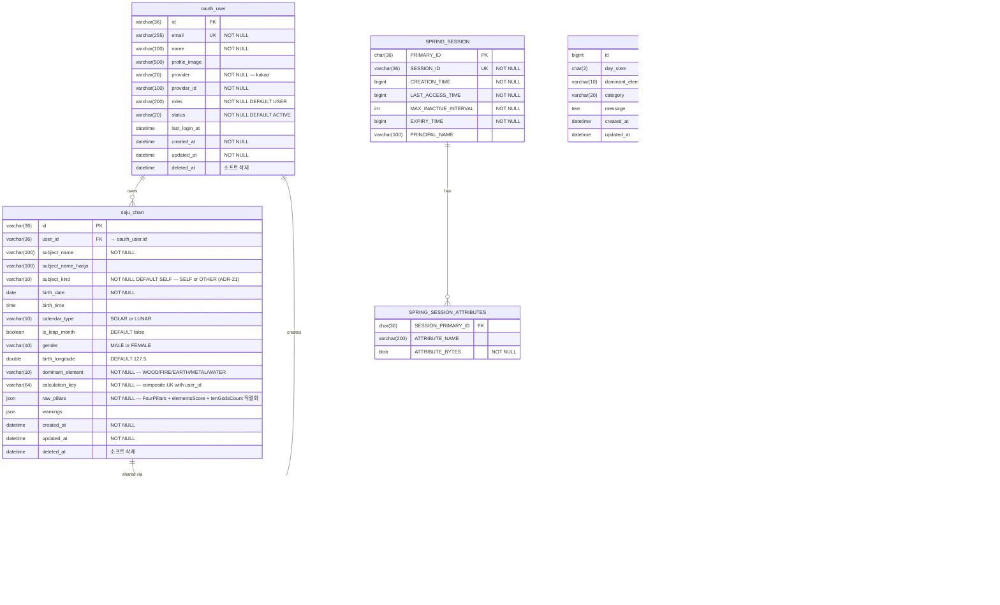

# Step 6: 데이터 설계 (2026-04-29 갱신)

> RDBMS: MySQL 8.x (ADR-07)
> 마이그레이션: Flyway 10.x (ADR-09). `ddl-auto: validate`로 전환.
> 본 갱신: lunar-java 전환, session-jdbc 도입, MVP 스코프 갱신(ADR-22 — 공유·카테고리 운세·오늘의 운세 포함), 모듈 제거(ADR-19) 반영.

---

## MVP에서 사용하는 테이블

| 테이블 | 역할 | 마이그레이션 |
|---|---|---|
| `oauth_user` | 카카오 로그인 사용자 (메인 사용자 테이블, ADR-04) | V1 |
| `SPRING_SESSION` | spring-session-jdbc 세션 헤더 | V2 |
| `SPRING_SESSION_ATTRIBUTES` | spring-session-jdbc 세션 속성 | V2 |
| `saju_chart` | 사용자 소유 사주 이력 (본인·친구·가족 차트, ADR-08·ADR-21) | V2 |
| `saju_share_link` | 공유 링크 토큰 (ADR-22, MVP 포함) | V2 |
| `key_message` | 키 메시지 + 카테고리 운세 6종 사전 생성 (ADR-24, 50조합 + 300조합) | V2 |
| `daily_fortune_template` | 오늘의 운세 사전 생성 템플릿 (ADR-24, 1000조합) | V2 |

## 본 스프린트에서 제거/폐기

| 테이블 | 처리 | 사유 |
|---|---|---|
| `refresh_token` | DROP (V2) | session-jdbc 전환 (ADR-15) |
| `notification` | DROP (V2) | 모듈 제거 (ADR-19) |
| `hanja` | DROP (V2) | 모듈 제거 (ADR-19) |
| `users` | (이미 미사용) | ADR-04. 운영 cleanup 시점에 DROP |
| `saju_results` | KEEP (deprecated) | 기존 캐시 데이터 보존, 신규 조회 차단 |

## Post-MVP 도입 테이블

| 테이블 | 역할 | 마이그레이션 |
|---|---|---|
| `saju_chart.ai_*` 컬럼 | 풀 AI 해석 상태/결과 (긴 텍스트, Post-MVP) | V3 |
| `saju_chart.anonymized_at`, `anonymous_user_id` | 익명화 (Post-MVP, ADR-17) | V4 |
| `notification_subscription` | PWA 푸시 옵트인 (Post-MVP, ADR-23 재고 시) | V5 |

---

## ERD (MVP)



> **note**: `key_message`와 `daily_fortune_template`는 사용자 데이터가 아닌 **사전 생성된 컨텐츠**. FK 없음. 어드민 시드 도구로 LLM 호출하여 채움.

---

## 인덱스 전략 (MVP)

| 테이블 | 인덱스 | 목적 |
|---|---|---|
| `oauth_user` | `(email)` UNIQUE | 로그인 조회 |
| `oauth_user` | `(provider, provider_id)` | OAuth 사용자 조회 |
| `saju_chart` | `(user_id, created_at DESC, id)` | 이력 목록 (커서 페이지네이션 안정 정렬) |
| `saju_chart` | `(user_id, calculation_key)` UNIQUE | 사용자별 동일 입력 중복 차단 (전역에서 사용자별로 변경). `calculation_key = SHA-256(birth_date \|\| birth_time_or_UNKNOWN \|\| gender \|\| calendar_type \|\| is_leap_month \|\| subject_kind \|\| subject_name)[:64]` |
| `saju_share_link` | `(token)` UNIQUE | 공유 토큰 조회 |
| `saju_share_link` | `(chart_id)` | 차트 삭제 시 일괄 폐기 |
| `saju_share_link` | `(user_id, created_at DESC)` | 사용자별 공유 이력 (Post-MVP UI) |
| `key_message` | `(day_stem, dominant_element, category)` UNIQUE | 룩업 키 (3컬럼 복합) |
| `daily_fortune_template` | `(day_stem, daily_stem, daily_branch)` UNIQUE | 룩업 키 (3컬럼 복합) |
| `SPRING_SESSION` | `(EXPIRY_TIME)`, `(SESSION_ID)` UNIQUE, `(PRINCIPAL_NAME)` | spring-session-jdbc 표준 |

---

## 소프트 삭제 정책 (MVP)

- `oauth_user.deleted_at IS NULL` — 모든 사용자 조회의 기본 필터
- `saju_chart.deleted_at IS NULL` — 모든 차트 조회의 기본 필터
- 세션 만료는 spring-session-jdbc가 `EXPIRY_TIME` 기반 자동 처리
- Hibernate `@Where` 또는 Querydsl 기본 조건으로 적용

---

## 마이그레이션 스크립트 (Flyway)

> 실제 SQL은 [`migrations/`](./migrations/README.md) 디렉터리의 V1\~V4 파일.
> Flyway 도입 시 `src/main/resources/db/migration/`로 이동.

### V1 — 베이스라인
- 기존 운영 환경의 `oauth_user`, `saju_results`, `solar_terms` 캡처
- 신규 환경에서 처음부터 안전하게 만들기 위한 정본

### V2 — MVP 스키마 정렬 (W1\~W2 스프린트)
- `saju_chart` 신규 생성 (FK → `oauth_user.id`, `subject_kind` · `dominant_element` 컬럼 포함)
- `SPRING_SESSION`, `SPRING_SESSION_ATTRIBUTES` 신규 생성 (Spring Session JDBC 공식 스키마)
- `saju_share_link` 신규 생성 (token UK, expires_at, revoked_at)
- `key_message` 신규 생성 (day_stem × dominant_element × category 3컬럼 UK)
- `daily_fortune_template` 신규 생성 (day_stem × daily_stem × daily_branch 3컬럼 UK)
- `oauth_user.deleted_at` 컬럼 추가 (멱등)
- DROP: `refresh_token`, `notification`, `hanja`, `hanja_*` (ADR-15/19)
- `saju_results`는 KEEP (조회 차단은 애플리케이션에서 처리)

### V3 — Post-MVP: 풀 AI 해석 상태
- `saju_chart`에 `ai_status`, `ai_requested_at`, `ai_completed_at`, `ai_interpretation` 컬럼 추가 (긴 텍스트 비동기 해석용)
- 본 스프린트 외

### V4 — Post-MVP: PII 익명화
- `saju_chart`에 `anonymized_at`, `anonymous_user_id` 추가
- `oauth_user.email`, `name` 해시 컬럼 분리
- 본 스프린트 외

### V5 — Post-MVP: PWA 푸시 옵트인 (ADR-23 재고 시)
- `notification_subscription` 신규 (user_id, endpoint, p256dh, auth, created_at)
- 본 스프린트 외

---

## Flyway 적용 설정 (W1 Pre-work)

```yaml
spring:
  flyway:
    enabled: true
    locations: classpath:db/migration
    baseline-on-migrate: true
    baseline-version: 1
  jpa:
    hibernate:
      ddl-auto: validate   # update에서 변경 (ADR-09)
  session:
    store-type: jdbc
    jdbc:
      initialize-schema: never  # Flyway에서 직접 관리
    timeout: 14d
```

```gradle
implementation 'org.flywaydb:flyway-core'
implementation 'org.flywaydb:flyway-mysql'
implementation 'org.springframework.session:spring-session-jdbc'
```
