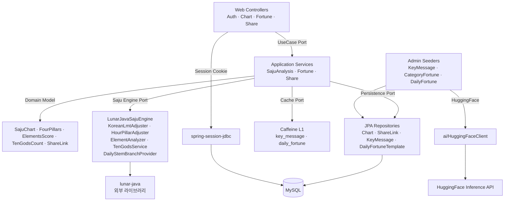

# Step 7: 코드 아키텍처 (2026-04-29 갱신)

> MVP 스코프(ADR-22). 모듈 제거(ADR-19 부분 변경): `notification`, `hanja`만 제거. **`ai/`는 어드민 시드 도구로 유지** (ADR-19/24).
> 사주 엔진(ADR-13): `engine/` 제거 → `saju.adapter.out.engine`로 lunar-java 어댑터 통합 (`ElementAnalyzer`, `TenGodsService`, `DailyStemBranchProvider` 어댑터 내 재구현).
> 인증(ADR-15): `auth.infrastructure.jwt/*` 제거.
> 공유·카테고리 운세·오늘의 운세 MVP 포함(ADR-22, ADR-26): `share/`, `fortune/` 도메인 신규.

---

## 패키지 구조 (MVP 종료 시점)

```
com.company.saju
├── SajuBackendApplication.java
│
├── common/                          # 횡단 관심사
│   ├── domain/
│   │   ├── BaseEntity.java
│   │   └── BaseTimeEntity.java
│   ├── dto/
│   │   ├── ApiResponse.java
│   │   ├── CursorPageResponse.java
│   │   └── PageResponse.java
│   ├── exception/
│   │   ├── BusinessException.java
│   │   ├── ErrorCode.java
│   │   └── GlobalExceptionHandler.java
│   └── util/
│       └── IdGenerator.java         # UUID v7
│
├── auth/                            # 인증 도메인 (session-jdbc)
│   ├── adapter/
│   │   ├── in/web/AuthController.java          # /auth/me, /auth/logout
│   │   └── out/
│   │       ├── oauth2/KakaoOAuthSuccessHandler.java
│   │       └── persistence/
│   │           ├── entity/OAuthUserEntity.java
│   │           └── repository/OAuthUserRepository.java
│   ├── application/
│   │   ├── dto/UserMeResponse.java
│   │   └── service/AuthService.java
│   └── infrastructure/
│       ├── config/
│       │   ├── SecurityConfig.java             # 세션 기반
│       │   ├── KakaoOAuth2Properties.java
│       │   ├── SessionConfig.java              # spring-session-jdbc
│       │   └── JpaAuditingConfig.java
│       └── (jwt/* 폴더 제거됨 — ADR-15)
│
├── saju/                            # 사주 차트 도메인 (이력 통합)
│   ├── adapter/
│   │   ├── in/web/
│   │   │   ├── ChartController.java                # POST/GET /charts, GET /charts/{id}, DELETE /charts/{id}
│   │   │   ├── FortuneController.java              # GET /charts/{id}/categories, /charts/{id}/today
│   │   │   ├── ShareController.java                # POST /shares, GET /shares/{token}
│   │   │   └── dto/
│   │   │       ├── ChartCreateRequest.java
│   │   │       ├── ChartResponse.java              # subjectKind, elementsScore, tenGodsCount, keyMessage 포함
│   │   │       ├── ChartSummaryDto.java
│   │   │       ├── PillarDto.java
│   │   │       ├── CategoryFortunesResponse.java
│   │   │       ├── TodayFortuneResponse.java
│   │   │       ├── ShareCreatedResponse.java
│   │   │       └── PublicChartDto.java             # 공유 페이지 PII 마스킹
│   │   └── out/
│   │       ├── persistence/
│   │       │   ├── entity/
│   │       │   │   ├── SajuChartEntity.java        # subject_kind 컬럼 추가 (SELF/OTHER)
│   │       │   │   ├── SajuShareLinkEntity.java
│   │       │   │   ├── KeyMessageEntity.java       # day_stem × dominant_element × category
│   │       │   │   └── DailyFortuneTemplateEntity.java
│   │       │   └── repository/
│   │       │       ├── SajuChartRepository.java
│   │       │       ├── SajuShareLinkRepository.java
│   │       │       ├── KeyMessageRepository.java
│   │       │       └── DailyFortuneTemplateRepository.java
│   │       └── engine/                             # 사주 엔진 어댑터 (ADR-13)
│   │           ├── LunarJavaSajuEngine.java        # SajuEnginePort 구현
│   │           ├── KoreanLmtAdjuster.java          # KST +30분 LMT 보정
│   │           ├── HourPillarAdjuster.java         # 자시/야자시 분기
│   │           ├── ElementAnalyzer.java            # 오행 점수 (MVP 노출, ADR-22)
│   │           ├── TenGodsService.java             # 십신 카운트 (MVP 노출, ADR-22)
│   │           └── DailyStemBranchProvider.java    # 임의 날짜 일진 (오늘의 운세용, ADR-26)
│   ├── application/
│   │   ├── port/
│   │   │   ├── in/
│   │   │   │   ├── CreateChartUseCase.java
│   │   │   │   ├── GetChartUseCase.java
│   │   │   │   ├── ListChartsUseCase.java
│   │   │   │   ├── DeleteChartUseCase.java
│   │   │   │   ├── GetCategoryFortunesUseCase.java
│   │   │   │   ├── GetTodayFortuneUseCase.java
│   │   │   │   ├── CreateShareUseCase.java
│   │   │   │   └── GetPublicChartUseCase.java
│   │   │   └── out/SajuEnginePort.java             # FourPillars + ElementsScore + TenGodsCount
│   │   ├── service/
│   │   │   ├── SajuAnalysisService.java            # 차트 생성·조회·삭제
│   │   │   ├── FortuneService.java                 # 카테고리·오늘의 운세 조회 (캐시 룩업)
│   │   │   └── ShareService.java                   # 공유 토큰 발급·조회·폐기
│   │   ├── seeder/                                 # 어드민 LLM 시드 도구 (ADR-24)
│   │   │   ├── KeyMessageSeeder.java               # 50조합 (일간×지배오행) 키 메시지
│   │   │   ├── CategoryFortuneSeeder.java          # 300조합 (50×6) 카테고리 운세
│   │   │   └── DailyFortuneSeeder.java             # 1000조합 오늘의 운세
│   │   └── dto/BirthInfo.java
│   └── domain/
│       └── model/
│           ├── SajuChart.java
│           ├── SubjectKind.java                    # SELF, OTHER
│           ├── FourPillars.java
│           ├── Pillar.java
│           ├── HeavenlyStem.java
│           ├── EarthlyBranch.java
│           ├── Element.java
│           ├── ElementsScore.java
│           ├── TenGod.java
│           ├── TenGodsCount.java
│           ├── FortuneCategory.java                # OVERALL, WEALTH, LOVE, HEALTH, CAREER, FAMILY
│           ├── KeyMessage.java
│           ├── DailyFortune.java
│           └── ShareLink.java
│
├── ai/                              # LLM 시드 도구 전용 (사용자 요청 경로 미사용, ADR-19/24)
│   ├── adapter/HuggingFaceClient.java              # 어드민 Seeder만 호출
│   ├── application/
│   │   ├── HuggingFaceService.java
│   │   └── PromptBuilder.java                      # 키 메시지·카테고리·오늘 운세 prompt 템플릿
│   └── dto/{LLMRequest, LLMResponse}.java
│
└── user/                            # 사용자 도메인 (제한적 사용)
    ├── adapter/out/persistence/(미사용 enum/dto만 유지)
    └── domain/model/{Gender, CalendarType, UserStatus}.java
```

### 제거되는 패키지 (W1 Refactor 스프린트)

| 패키지 | 처리 | 사유 |
|---|---|---|
| `engine/` 전체 | **삭제** | lunar-java로 대체 (ADR-13) |
| `notification/` 전체 | **삭제** | ADR-19 |
| `hanja/` 전체 | **삭제** | ADR-19 |
| `auth.infrastructure.jwt/*` | **삭제** | session-jdbc (ADR-15) |
| `auth.adapter.out.persistence.entity.RefreshTokenEntity` 등 | **삭제** | session-jdbc |
| `history/` 전체 | **흡수** | `saju.adapter.in.web.ChartController`로 통합 (단일 자원 경로 `/charts`) |

### 유지/신규 패키지

| 패키지 | 처리 | 사유 |
|---|---|---|
| `ai/` 전체 | **유지** (어드민 시드 도구 전용) | ADR-19/24 부분 변경 — 사용자 요청 경로 호출 없음, Seeder만 사용 |
| `saju.adapter.in.web.ShareController` | **신규** | ADR-22 (공유 MVP 포함) |
| `saju.adapter.in.web.FortuneController` | **신규** | ADR-26 (카테고리·오늘의 운세 MVP 포함) |
| `saju.application.seeder/*` | **신규** | ADR-24 (LLM precompute Seeder) |
| `saju.adapter.out.engine.{ElementAnalyzer, TenGodsService, DailyStemBranchProvider}` | **신규** | ADR-22, ADR-26 |

---

## 헥사고날 포트/어댑터 (MVP)

### 사주 엔진 포트 (`SajuEnginePort`)

```java
// saju/application/port/out/SajuEnginePort.java
public interface SajuEnginePort {

    /**
     * 출생 정보로 사주 분석 결과(사주팔자 + 오행 점수 + 십신 카운트 + 지배 오행) 계산.
     * 한국식 보정(KST +30분 LMT, 자시/야자시) 어댑터 내부에서 처리.
     */
    SajuAnalysis analyze(BirthInfo birthInfo);
}

// saju/application/dto/SajuAnalysis.java
public record SajuAnalysis(
    FourPillars fourPillars,
    ElementsScore elementsScore,        // 오행 5종 점수 (S5-1)
    Element dominantElement,            // elementsScore 최대값 오행. 동점 시: 목>화>토>금>수 (전통 순서)
    TenGodsCount tenGodsCount,          // 십신 카운트 6장 (S5-2)
    List<String> warnings
) {}
```

> **`dominantElement` 계산 규칙**: `ElementAnalyzer`가 5종 점수를 반환한 후, max 값의 오행을 선택. 동점 시 전통 오행 우선순위 WOOD > FIRE > EARTH > METAL > WATER 순으로 결정.
>
> **`tenGodsCount` 6장 선정 규칙**: 사주 8자(천간 4 + 지지 4)에서 일간(Day Stem) 대비 각 십신 등장 횟수를 카운트. count 내림차순 상위 5개 + 일주 카드(항상 포함) = 6장. 동점 시 우선순위: 비견 > 겁재 > 식신 > 상관 > 편재 > 정재 > 편관 > 정관 > 편인 > 정인. count > 0인 십신이 5개 미만이면 count=0 십신으로 채워 6장을 만든다.
>
> **`calculation_key` 생성 규칙**: `SHA-256(birth_date || birth_time_or_UNKNOWN || gender || calendar_type || is_leap_month || subject_kind || subject_name)` hex 앞 64자. `SajuAnalysisService.createChart()` 진입 시 생성, `(user_id, calculation_key)` 복합 UK로 중복 차단. 중복 시 기존 차트 반환.

### 사주 엔진 어댑터 (`LunarJavaSajuEngine`)

```java
// saju/adapter/out/engine/LunarJavaSajuEngine.java
@Component
public class LunarJavaSajuEngine implements SajuEnginePort {
    private final KoreanLmtAdjuster lmtAdjuster;
    private final HourPillarAdjuster hourAdjuster;
    private final ElementAnalyzer elementAnalyzer;
    private final TenGodsService tenGodsService;

    @Override
    public SajuAnalysis analyze(BirthInfo birthInfo) {
        LocalDateTime adjusted = lmtAdjuster.adjust(birthInfo);

        Solar solar = Solar.fromYmdHms(...);
        Lunar lunar = solar.getLunar();
        EightChar bazi = lunar.getEightChar();

        FourPillars raw = mapToFourPillars(bazi);
        FourPillars pillars = hourAdjuster.adjust(raw, birthInfo);

        ElementsScore elements = elementAnalyzer.analyze(pillars);
        Element dominant = elementAnalyzer.dominant(elements);  // max값 오행, 동점=목>화>토>금>수
        TenGodsCount tenGods = tenGodsService.count(pillars);

        return new SajuAnalysis(pillars, elements, dominant, tenGods, collectWarnings(birthInfo));
    }
}
```

### Fortune 도메인 (카테고리·오늘의 운세)

```java
// saju/application/service/FortuneService.java
@Service
@Transactional(readOnly = true)
public class FortuneService implements GetCategoryFortunesUseCase, GetTodayFortuneUseCase {
    private final SajuChartRepository chartRepo;
    private final KeyMessageRepository keyMessageRepo;
    private final DailyFortuneTemplateRepository dailyRepo;
    private final DailyStemBranchProvider dailyProvider;
    private final Cache<String, CategoryFortunesResponse> categoryCache;
    private final Cache<String, TodayFortuneResponse> todayCache;

    public CategoryFortunesResponse getCategories(UUID chartId, UUID userId) {
        SajuChart chart = chartRepo.requireOwnedById(chartId, userId);
        String cacheKey = chart.dayStem() + ":" + chart.dominantElement();
        return categoryCache.get(cacheKey, () ->
            keyMessageRepo.findAll6Categories(chart.dayStem(), chart.dominantElement())
        );
    }

    public TodayFortuneResponse getToday(UUID chartId, UUID userId) {
        SajuChart chart = chartRepo.requireOwnedById(chartId, userId);
        LocalDate today = LocalDate.now(KST);
        String cacheKey = chartId + ":" + today;
        return todayCache.get(cacheKey, () -> {
            var todayDayPillar = dailyProvider.of(today);
            return dailyRepo.findOne(chart.dayStem(), todayDayPillar.stem(), todayDayPillar.branch());
        });
    }
}
```

### Share 도메인

```java
// saju/application/service/ShareService.java
@Service
@Transactional
public class ShareService implements CreateShareUseCase, GetPublicChartUseCase {
    private final SajuChartRepository chartRepo;
    private final SajuShareLinkRepository shareRepo;
    private final TokenGenerator tokenGenerator;        // 8자 URL-safe slug

    public ShareCreatedResponse createShare(UUID chartId, UUID userId) {
        SajuChart chart = chartRepo.requireOwnedById(chartId, userId);
        var link = SajuShareLink.create(chart, userId, tokenGenerator.next());
        shareRepo.save(link);
        return new ShareCreatedResponse(link.token(), buildUrl(link.token()), link.expiresAt());
    }

    @Transactional(readOnly = true)
    public PublicChartDto getPublic(String token) {
        var link = shareRepo.findActiveByToken(token).orElseThrow(ShareNotFoundException::new);
        var chart = chartRepo.requireById(link.chartId());
        return PublicChartMapper.toMaskedDto(chart);    // PII 마스킹
    }
}
```

### Seeder 어드민 도구 (LLM precompute, ADR-24)

> 사용자 요청 경로에서는 호출 안 됨. CLI/REST 어드민 트리거로만 실행 (예: `POST /admin/seed/key-messages` 인증 필수).

```java
// saju/application/seeder/KeyMessageSeeder.java
@Component
public class KeyMessageSeeder {
    private final HuggingFaceService llm;        // ai/ 패키지에서 가져옴 (ADR-19 부분 변경)
    private final PromptBuilder prompts;
    private final KeyMessageRepository repo;

    public int seedAll() {
        // 일간 10 × 지배 오행 5 = 50조합
        for (HeavenlyStem stem : HeavenlyStem.values()) {
            for (Element element : Element.values()) {
                String prompt = prompts.forKeyMessage(stem, element);
                String message = llm.generate(prompt);
                repo.upsert(stem, element, FortuneCategory.OVERALL, message);
            }
        }
        return 50;
    }
}

// saju/application/seeder/CategoryFortuneSeeder.java
@Component
public class CategoryFortuneSeeder {
    public int seedAll() {
        // 일간 10 × 지배 오행 5 × 6 카테고리 = 300조합 (총운 50개는 KeyMessageSeeder 결과 재사용 가능)
        // ...
        return 300;
    }
}

// saju/application/seeder/DailyFortuneSeeder.java
@Component
public class DailyFortuneSeeder {
    public int seedAll() {
        // 일간 10 × 일진 천간 10 × 일진 지지 12 = 1200, 룰로 압축 후 약 1000개
        // ...
        return 1000;
    }
}
```

---

## Virtual Threads (VT) 정책

```java
@Configuration
public class AsyncConfig {

    /** 외부 IO 전용 VT Executor. JPA 경로 사용 금지 (ADR-02). */
    @Bean(name = "vtIoExecutor")
    public Executor vtIoExecutor() {
        return Executors.newVirtualThreadPerTaskExecutor();
    }
}
```

| 경로 | 스레드 전략 | 근거 |
|---|---|---|
| `@Transactional` (JPA) | 플랫폼 스레드 | HikariCP yield-spin (ADR-02) |
| Kakao OAuth 토큰 교환 (Spring Security 내부 RestClient) | `vtIoExecutor` 권장 | 외부 HTTP IO |
| Actuator / 헬스체크 | Spring 기본 | 경량 |
| `HuggingFaceService` (Seeder 호출) | `vtIoExecutor` | 어드민 작업, LLM 외부 IO |

> 사용자 요청 경로에는 LLM 호출이 없으므로(사전 생성 캐시 룩업만) SLO에 LLM 지연 영향 없음.

---

## 캐시 정책 (MVP)

| 캐시 | 적용 | 키 | TTL | 사유 |
|---|---|---|---|---|
| 사주 계산 결과 | ❌ | — | — | 본인 차트는 매 요청 신규, DB write 1회 |
| `key_message` (카테고리 운세 6종) | ✅ Caffeine L1 | `(day_stem, dominant_element)` | 영구 (warmup 후 95%+ 히트) | 50/300조합 사전 생성, 동일 키 → 동일 결과 |
| `daily_fortune_template` (오늘의 운세) | ✅ Caffeine L1 | `(chart_id, date)` | 24h | 같은 사용자 같은 날에는 1회 DB 조회 |
| `oauth_user` 세션 ID lookup | ❌ | — | — | 세션 컨텍스트로 ID만 들고 다님, 필요 시 1회 조회 |
| 공유 페이지 차트 (S6) | ✅ HTTP 캐시 | `Cache-Control: public, max-age=300` | 5분 | 비로그인 공개 페이지, Vercel/CDN 친화 |

캐시 라이브러리: Spring Boot BOM의 Caffeine (~3.1.x). 인스턴스 별 메모리 한도: `key_message` 1000 entries, `daily_fortune_template` 10000 entries.

---

## 트랜잭션 경계

| 레이어 | 트랜잭션 |
|---|---|
| `SajuAnalysisService.createChart()` | `@Transactional` (DB write) |
| `SajuAnalysisService.list/get()` | `@Transactional(readOnly = true)` |
| `SajuAnalysisService.delete()` | `@Transactional` (소프트 삭제 + share_link revoke 일괄) |
| `FortuneService.getCategories/getToday()` | `@Transactional(readOnly = true)` (캐시 미스 시만 SELECT) |
| `ShareService.createShare()` | `@Transactional` (saju_share_link INSERT) |
| `ShareService.getPublic()` | `@Transactional(readOnly = true)` |
| `KakaoOAuthSuccessHandler.onAuthenticationSuccess()` | `@Transactional` (oauth_user upsert) |
| `LunarJavaSajuEngine.analyze()` | 트랜잭션 없음 (인메모리 계산) |
| `KeyMessageSeeder.seedAll()` (어드민) | `@Transactional` (배치 INSERT) |

---

## 모듈 다이어그램



---

## 주요 컨트롤러 시그니처 (W2\~W7 구현 가이드)

```java
// ChartController (단일 자원 경로 /charts)
@PostMapping("/charts")
public ApiResponse<ChartResponse> create(
    @AuthenticationPrincipal OAuth2User principal,
    @Valid @RequestBody ChartCreateRequest request
);

@GetMapping("/charts")
public ApiResponse<CursorPageResponse<ChartSummaryDto>> list(
    @AuthenticationPrincipal OAuth2User principal,
    @RequestParam(required = false) String cursor,
    @RequestParam(defaultValue = "20") int size
);

@GetMapping("/charts/{id}")
public ApiResponse<ChartResponse> get(
    @AuthenticationPrincipal OAuth2User principal,
    @PathVariable UUID id
);

@DeleteMapping("/charts/{id}")
public ApiResponse<Void> delete(
    @AuthenticationPrincipal OAuth2User principal,
    @PathVariable UUID id
);

// FortuneController
@GetMapping("/charts/{id}/categories")
public ApiResponse<CategoryFortunesResponse> categories(
    @AuthenticationPrincipal OAuth2User principal,
    @PathVariable UUID id
);

@GetMapping("/charts/{id}/today")
public ApiResponse<TodayFortuneResponse> today(
    @AuthenticationPrincipal OAuth2User principal,
    @PathVariable UUID id
);

// ShareController
@PostMapping("/shares")
public ApiResponse<ShareCreatedResponse> create(
    @AuthenticationPrincipal OAuth2User principal,
    @Valid @RequestBody CreateShareRequest request
);

@GetMapping("/shares/{token}")
public ApiResponse<PublicChartDto> getPublic(
    @PathVariable String token
);   // 익명 허용 (Spring Security permitAll)
```
