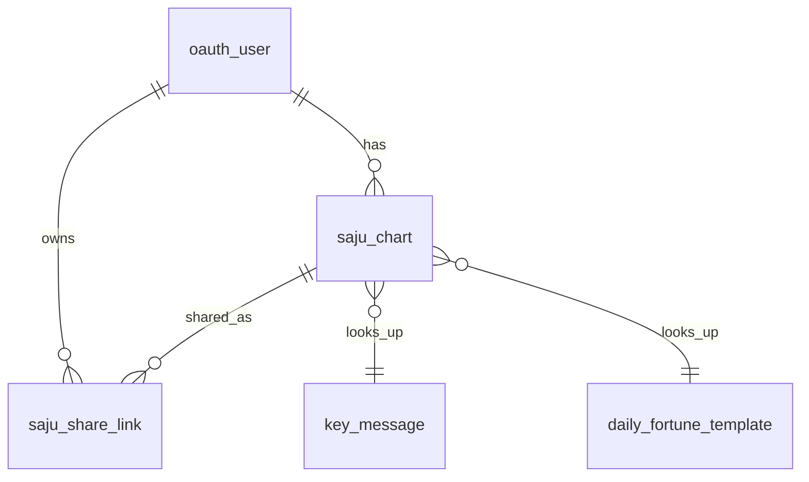

# Data Schema

## 테이블 목록 (7개 MVP)

```
oauth_user              — 카카오 OAuth 사용자
SPRING_SESSION          — spring-session-jdbc 세션
SPRING_SESSION_ATTRIBUTES — 세션 속성 (userId 등)
saju_chart              — 사주 차트 이력
saju_share_link         — 공유 토큰
key_message             — LLM 사전 생성 텍스트
daily_fortune_template  — 오늘의 운세 템플릿
```

---

## 테이블 상세

### oauth_user
```sql
id              VARCHAR(36)  PK
email           VARCHAR(255) UNIQUE NOT NULL
name            VARCHAR(100) NOT NULL
profile_image   VARCHAR(500)
provider        VARCHAR(20)  NOT NULL  -- 'kakao'
provider_id     VARCHAR(100) NOT NULL
roles           VARCHAR(200) NOT NULL  DEFAULT 'USER'
status          VARCHAR(20)  NOT NULL  DEFAULT 'ACTIVE'
last_login_at   DATETIME
created_at      DATETIME     NOT NULL
updated_at      DATETIME     NOT NULL
deleted_at      DATETIME     NULL      -- 소프트 삭제 (30일 유예)
```
- `@SQLRestriction("deleted_at IS NULL")` — 모든 JPA 쿼리에 자동 필터

### saju_chart
```sql
id                VARCHAR(36)  PK
user_id           VARCHAR(36)  FK(oauth_user) NOT NULL
subject_name      VARCHAR(100) NOT NULL
subject_name_hanja VARCHAR(100)
subject_kind      VARCHAR(10)  NOT NULL  -- SELF | OTHER
birth_date        DATE         NOT NULL
birth_time        TIME         NULL      -- NULL = 시간 불명
calendar_type     VARCHAR(10)  NOT NULL  -- SOLAR | LUNAR
is_leap_month     TINYINT(1)   NOT NULL  DEFAULT 0
gender            VARCHAR(10)  NOT NULL  -- MALE | FEMALE
birth_longitude   DOUBLE       NOT NULL  DEFAULT 127.5
dominant_element  VARCHAR(10)  NOT NULL  -- WOOD|FIRE|EARTH|METAL|WATER
calculation_key   VARCHAR(64)  NOT NULL  -- SHA-256(birth_date|birth_time|gender|calendar_type|is_leap_month|subject_kind|subject_name)
raw_pillars       JSON         NOT NULL  -- {fourPillars, elementsScore, tenGodsCount}
warnings          JSON
created_at        DATETIME     NOT NULL
updated_at        DATETIME     NOT NULL
deleted_at        DATETIME     NULL

UNIQUE KEY (user_id, calculation_key)   -- 동일 입력 중복 방지
KEY (user_id, created_at DESC, id)      -- 목록 조회
```
- `@SQLRestriction("deleted_at IS NULL")` 자동 필터
- `raw_pillars`는 중복 방지 + 캐싱용. 결과 표시는 항상 엔진 재계산.

### saju_share_link
```sql
id          VARCHAR(36) PK
chart_id    VARCHAR(36) FK(saju_chart) NOT NULL
user_id     VARCHAR(36) FK(oauth_user) NOT NULL
token       VARCHAR(16) UNIQUE NOT NULL  -- 8자 URL slug
expires_at  DATETIME    NOT NULL         -- 생성 + 1년
revoked_at  DATETIME    NULL             -- 차트/계정 삭제 시 set
created_at  DATETIME    NOT NULL

UNIQUE KEY (token)
```
- 소프트 삭제 없음. `revoked_at IS NULL AND expires_at > NOW()` = 유효

### key_message
```sql
id               BIGINT AUTO_INCREMENT PK
day_stem         CHAR(2)     NOT NULL  -- 일간 천간 한자 (甲乙丙丁戊己庚辛壬癸)
dominant_element VARCHAR(10) NOT NULL  -- WOOD|FIRE|EARTH|METAL|WATER
category         VARCHAR(20) NOT NULL  -- OVERALL|WEALTH|LOVE|HEALTH|CAREER|FAMILY
message          TEXT        NOT NULL
created_at       DATETIME    NOT NULL
updated_at       DATETIME    NOT NULL

UNIQUE KEY (day_stem, dominant_element, category)  -- 룩업 키
```
- 10 stems × 5 elements × 7 categories = **350행** (OVERALL 포함)
- Caffeine L1 캐시 (영구 TTL)

### daily_fortune_template
```sql
id           BIGINT AUTO_INCREMENT PK
day_stem     CHAR(2) NOT NULL  -- 사용자 일간
daily_stem   CHAR(2) NOT NULL  -- 오늘 일진 천간
daily_branch CHAR(2) NOT NULL  -- 오늘 일진 지지
message      TEXT    NOT NULL
lucky_color  VARCHAR(50)  NOT NULL
lucky_hour   VARCHAR(50)  NOT NULL
caution      VARCHAR(100) NOT NULL
created_at   DATETIME     NOT NULL
updated_at   DATETIME     NOT NULL

UNIQUE KEY (day_stem, daily_stem, daily_branch)  -- 룩업 키
```
- 10 day_stems × 60 유효 간지 = **600행**
- Caffeine L1 캐시 (24h TTL)

---

## 연관 관계



---

## 소프트 삭제 정책

| 테이블 | 삭제 방식 | 연쇄 |
|---|---|---|
| `oauth_user` | `deleted_at` set | → chart 소프트 삭제 → share_link revoke |
| `saju_chart` | `deleted_at` set | → share_link revoke |
| `saju_share_link` | `revoked_at` set | - |

카카오 연동 앱의 30일 유예 정책 준수를 위해 물리 삭제 없음.

---

## Flyway 마이그레이션

| 버전 | 내용 |
|---|---|
| V1 | 기존 테이블 baseline + 절기 시드 데이터 |
| V2 | MVP 스키마 정렬 (saju_chart, SPRING_SESSION, share_link, key_message, daily_fortune_template 신규 / refresh_token, notification, hanja DROP) |
