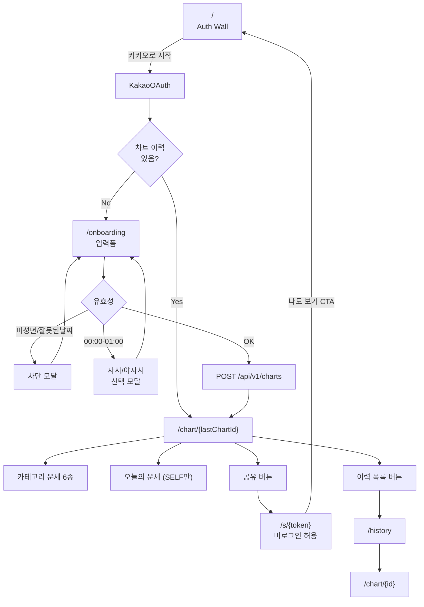

# User Flow

## 여정 맵

---

## 화면 명세

### S1. Landing (`/`)
- **비로그인 상태만** 표시. 로그인 사용자는 즉시 redirect.
- 구성: 로고, hero 카피("당신의 사주, 한눈에"), 카카오 로그인 버튼, 약관 링크
- CTA: `GET /oauth2/authorization/kakao`
- 에러: OAuth 실패 → 에러 토스트 + 재시도

### S2. Kakao OAuth Callback (백엔드 핸들)
- URL: `https://api.saju.app/login/oauth2/code/kakao`
- 신규 사용자 → `/onboarding` redirect
- 기존 + 차트 있음 → `/chart/{lastChartId}` redirect
- 기존 + 차트 없음 → `/onboarding` redirect

### S3. 입력폼 (`/onboarding`)
- 필드: 이름, 생년월일(Date picker), 생시(Time picker + "모름" 토글), 양력/음력 선택, 음력 윤달 여부, 성별
- "나 자신" / "다른 사람" 탭 (subject_kind)
- 입력 차단: 만 14세 미만 → 안내 모달 + 제출 불가
- 자시 처리: 00:00-01:00 입력 시 야자시/자시 모달 → 선택 후 제출
- 중복 차트: 서버가 동일 calculation_key 감지 → 기존 차트 반환 (201 대신 200)

### S4. 결과 first fold (`/chart/{id}`)
- **사주 4기둥** (연월일시 천간지지 한자 + 한글 뜻)
- **핵심 메시지** (LLM 사전 생성, key_message.category=OVERALL)
- **공유 버튼** (고정 액션바) — first fold에 반드시 노출
- 아래로 스크롤 → S5 시리즈

### S5. 결과 상세
| 섹션 | 내용 |
|---|---|
| S5-1 | 5행 도넛 차트 (목화토금수 %) |
| S5-2 | 성격 카드 6장 (십신 top 6) |
| S5-3 | 카테고리 운세 6종 (카드 펼침형) |
| S5-4 | 오늘의 운세 (SELF 차트만, OTHER는 숨김) |
| S5-5 | 고정 액션바: 공유 / 다른 사람 보기 / 내 이력 |

### S6. 공유 페이지 (`/s/{token}`)
- **비로그인 접근 허용**
- PII 마스킹: 이름 첫글자 + ○○ (예: 김○○)
- 표시: 사주 4기둥 + 5행 도넛 + 핵심 메시지 + 카테고리 운세 (읽기 전용)
- CTA: "나도 사주 보기" → Landing
- 만료/폐기된 토큰 → 404 안내

### S7. 이력 목록 (`/history`)
- 내 차트 리스트 (subject_name + 생년월일 + 생성일)
- offset 페이지 (page/size)
- 삭제 버튼 → 소프트 삭제 + 공유링크 폐기

### S8. 이력 단건 (`/chart/{id}`)
- S4+S5 동일 구조, 엔진 재계산으로 최신값 표시

---

## 엣지케이스 매트릭스

| 상황 | 처리 |
|---|---|
| 만 14세 미만 | 차단 모달, 제출 불가 |
| 잘못된 날짜 (예: 2월 31일) | 즉시 오류 표시, 제출 불가 |
| 자시 (00:00-01:00) | 야자시/자시 선택 모달 강제 |
| 시간 모름 | 허용, 결과에서 "시주 미포함" 표시 |
| OTHER 차트 오늘의 운세 | API 403, UI에서 섹션 숨김 |
| 만료/폐기 공유 링크 | 404 안내 화면 |
| 중복 차트 생성 | 기존 차트 반환 (투명하게 처리) |
| 카카오 OAuth 실패 | 에러 토스트 + 재시도 |
